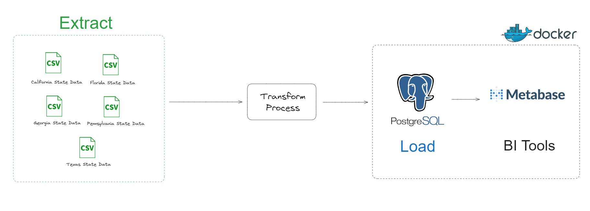

# **Project End-to-End Data Pipeline Metabase**
---

- Merupakan Repository yang digunakan untuk [Thread Twitter Pacmann](https://twitter.com/pacmannai/status/1788465705664290902)
- Tujuan dari repo ini adalah untuk menjadi bahan referensi membuat End-to-End Project Data Engineering
- Teman - teman bisa mengganti data source dengan kebutuhan masing - masing. Bisa menggunakan data dalam bentuk JSON/API, CSV lain, atau bahkan dalam bentuk Database.
- Pada case ini, kita akan menggunakan Data Sales Car yang terdiri dari 5 states: `["California", "Florida", "Georgia", "Pennsylvania", "Texas"]`
- Data tersebut dalam bentuk `csv` dan ada di `data/`
- Untuk proses Transform yang dilakukan adalah
    - Menggabungkan lima data menjadi satu data
    - Filter `selling_price > 14000` 

- Untuk service `Postgres` dan `Metabase` akan kita host dengan Docker Service
- Untuk menjalankan service tersebut, pastikan sudah ada `docker-compose.yml`
- Lalu, untuk menjalankannya masukkan command `docker compose up -d --build`

### **Workflow**
---



### **Tools**
---
1. Python
2. Pandas
3. SQL
4. Docker
5. Metabase

### **How to Run the Project**
---

- Untuk menjalankan Data Pipeline cukup dengan command

    ```bash
    python data_pipeline.py
    ```

- Config Database dan Metabase
    ```Dotenv
    DB_USERNAME = "postgres"
    DB_PASSWORD = "mypassword"
    DB_HOST = "localhost"
    DB_PORT = "5434"
    DB_NAME = "db_sales"
    ```

- Untuk menggunakan Metabase, gunakan url `http://localhost:3000/`

Tabik

Tepe
